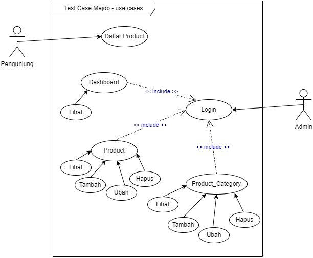

<p align="center"><a href="https://laravel.com" target="_blank"></a></p>

</p>

## 📒 Technical Docs
1. Admin Access
2. Entity Realtionship Diagram (ERD)
3. Data Manipulation Language (DML)
4. Activity Diagrams
5. Use Case Diagram


### 👨‍💻 Admin Access

> Akun Admin <br/>
> email : admin1@example.com <br/>
> password : 12345678 <br/>
> url : localhost:8000/login

### 🔗 Entity Relationship Diagram (ERD)


### ⚙️ Data Manipulation Language (DML)

1. Produk
   + Menampilkan semua data (SELECT)
        ```sql
        SELECT product.id, product.name, product.description, product.price, product.category_id , prc.name as category  
        FROM product 
        JOIN product_category as prc ON prc.id = product.category_id 
        WHERE id > 1 LIMIT 20;
        ```
   + Menampilkan data berdasarkan Id (SELECT WHERE)
        ```sql
        SELECT product.id, product.name, product.description, product.price, product.category_id , prc.name as category
        FROM product 
        JOIN product_category as prc ON prc.id = product.category_id 
        WHERE id = 1;
        ```
   + Menambahkan / menyimpan data baru
        - Single
        ```sql
        INSERT INTO product (name, description, thumbnail, price, added_by) 
        VALUES 
        ('printer', 'Ini deskripsi printer', 'img/product/printer.jpg', 1250000, 1);
        ```

        - Multiple
        ```sql
        INSERT INTO product (name, description, thumbnail, price, added_by) 
        VALUES 
        ('Printer 1', 'Ini deskripsi printer 1', 'img/product/printer1.jpg', 1250000, 1),
        ('Printer 2', 'Ini deskripsi printer 2', 'img/product/printer2.jpg', 1300000, 1);
        ```
   + Mengupdate /mengubah data
        ```sql
        UPDATE product SET 
        name = 'Printer 1 Update', description = 'Ini deskripsi update printer 1', 
        thumbnail = 'img/product/printer1.png', price = 1700000
        WHERE id = 1;
        ```
   + Menghapus data
        ```sql
        DELETE FROM product WHERE id = 1; 
        ```
2. Kategori
   + Menampilkan semua data (SELECT)
        ```sql
        SELECT * FROM product_category
        WHERE is_delete = 0 
        AND id > 1 LIMIT 20;
        ```
   + Menampilkan data berdasarkan Id (SELECT WHERE)
        ```sql
        SELECT * FROM product_category WHERE id = 1; 
        ```
   + Menambahkan / menyimpan data baru
        ```sql
        INSERT INTO product_category (name, description, added_by)
        VALUES ('kategori 1', 'deskripsi kategori 1', 1);
        ```
   + Mengupdate /mengubah data
        ```sql
        UPDATE product_category SET 
        name = 'kategori 1 update', description = 'Ini deskripsi update printer 1' 
        WHERE id = 1;
        ```
   + Menghapus data
        ```sql
        UPDATE product_category SET is_delete = 1
        WHERE id = 1;
        ```


### Activity Diagrams
1. Produk
   + Tambah Produk
    

   + Ubah Produk
   + Hapus Produk
2. Kategori


### Use Case Diagram

